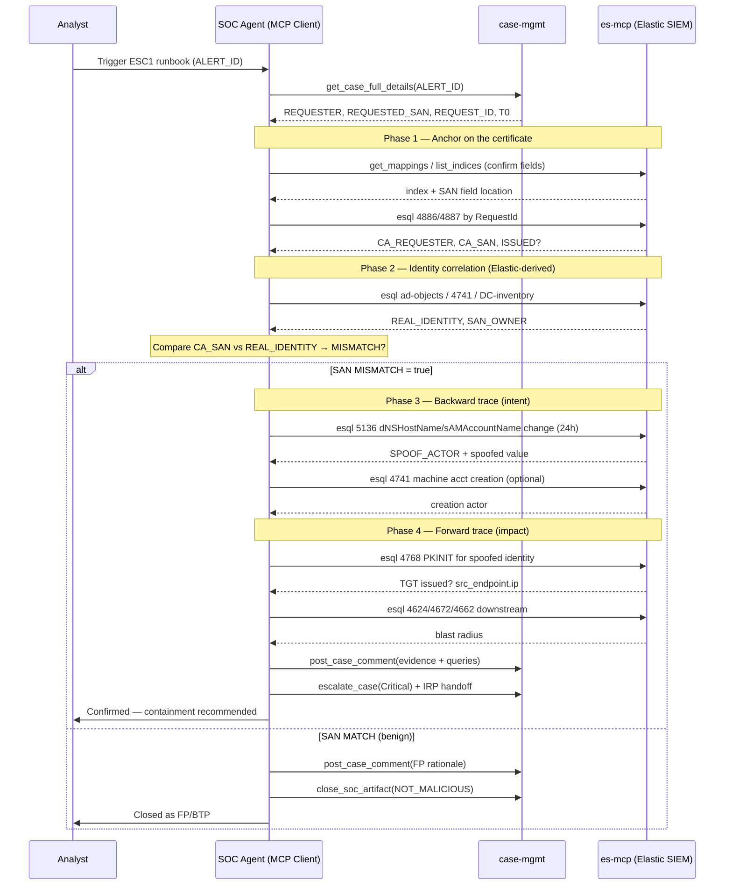

# Runbook: ADCS ESC1 / Certifried Investigation

## Objective

To triage, investigate, and confirm (or refute) a suspected **ADCS ESC1 / Certifried** attack in which an attacker abuses a vulnerable certificate template (or the CVE-2022-26923 machine-account path) to request a certificate that authenticates *as* a higher-privileged identity (typically a Domain Controller) by spoofing the **Subject Alternative Name (SAN)**.

This runbook implements the **Reverse Trace Strategy**: rather than waiting for the full kill chain to play out forward, the agent starts from the highest-fidelity late-stage artifact (a certificate *issued* with a mismatched SAN), then walks **backward** to prove deliberate intent (the dNSHostName/sAMAccountName modification) and **forward** to measure impact (PKINIT TGT issuance and subsequent privileged logons).

## Scope

Covers ESC1-style SAN abuse and the "Certifried" machine-account variant (CVE-2022-26923). Includes AD identity correlation, Elastic log retrieval across the CA server and Domain Controllers, mismatch analysis, and a verdict decision. Produces containment recommendations and hands off to the ADCS-abuse IRP for eradication. Excludes ESC8 (NTLM relay to web enrollment — see [adcs_esc8_ntlm_relay_investigation.md](adcs_esc8_ntlm_relay_investigation.md)) and general certificate lifecycle management.

## Detection Signal / Trigger

This runbook is triggered by any of:

*   A SIEM detection rule firing on **Event 4886/4887** (certificate requested/issued) where the requested SAN does not resolve to the requesting account's real identity.
*   A correlation alert linking **Event 5136** (dNSHostName/sAMAccountName modification on a machine account) to a subsequent certificate request.
*   A **4768** (Kerberos TGT via PKINIT) alert on a certificate whose issuance chain is anomalous.
*   Analyst-initiated hunt.

## Inputs

*   `${ALERT_ID}` or `${CASE_ID}`: Identifier for the triggering alert/case.
*   `${REQUEST_ID}`: (If available from the alert) The ADCS `RequestId` tying together 4886/4887.
*   `${REQUESTER_ACCOUNT}`: The account that requested the certificate (e.g., `GALACTIC\attacker$` or `GALACTIC\jdoe`).
*   `${REQUESTED_SAN}`: The SAN value embedded in the certificate request (e.g., `hoth.galactic.empire` or `upn=administrator@galactic.empire`).
*   *(Optional)* `${TIME_FRAME_HOURS}`: Lookback for backward-trace searches (default: `24`).
*   *(Optional)* `${CA_HOSTNAME}`: The CA server that issued the cert, to scope searches.

## Tools

*   **`es-mcp` (Elasticsearch SIEM — read-only):**
    *   `esql` — primary query tool (ES|QL); use for all timeline/correlation searches.
    *   `search` — Query DSL fallback for complex boolean/nested field queries.
    *   `get_mappings` / `list_indices` — resolve the correct OCSF index and confirm attribute paths before querying (ADCS-specific detail may sit under `unmapped.*` depending on parser maturity).
*   **`ad-mcp` (Active Directory / LDAP — read-only, OPTIONAL enrichment only):**
    *   `lookup_account` — *if available*, corroborate the requester's current `dNSHostName`/SID. **Primary identity resolution in this runbook is done from Elastic logs (below), not a live AD query** — do not block the investigation on this tool.
*   **`ti-mcp` (Threat Intel — optional):** enrich attacker source IP/host if external tooling is suspected.
*   **`case-mgmt` (Elastic Cases / SOAR):**
    *   `post_case_comment` — document findings.
    *   `escalate_case` / `change_case_priority` — escalate on confirmation.
*   **Common Steps:** `common_steps/enrich_ioc.md`, `common_steps/find_relevant_soar_case.md`, `common_steps/document_in_soc.md`, `common_steps/close_soc_artifact.md`.

> **Important — read-only guarantee:** All `es-mcp` and `ad-mcp` calls in this runbook are read-only. No containment (account disable, cert revocation, template lock) is executed by this runbook directly; it *recommends* actions and hands them to the ADCS IRP / human approval gate.

## Data Model Reference (Windows Event → OCSF, as indexed in Elastic)

All SIEM alerts in this environment are normalized to **OCSF** before indexing, so queries reference OCSF attribute paths — **not** raw ECS/`winlog.event_data.*`. Two things make the Reverse-Trace logic survive normalization: OCSF preserves the original **Windows Event ID** in `metadata.event_code`, and it preserves source-specific fields OCSF has no first-class home for under `unmapped.*`. Confirm the exact paths with `es-mcp.get_mappings` first — ADCS parsing maturity varies, so several high-signal fields below may or may not be promoted out of `unmapped.*`.

*   **Relevant OCSF class:** `4768` maps to **Authentication** (`class_uid 3002`, IAM category). `4886/4887` (ADCS request/issue) and `5136` (dir-object change) have **no dedicated OCSF class** — anchor them via `metadata.event_code` and read the detail from `unmapped.*`.

| Concept | Windows | OCSF (as indexed in Elastic) |
| --- | --- | --- |
| Event ID (anchor) | 4886/4887/5136/4768 | `metadata.event_code` |
| Log channel | Security | `metadata.log_name` (`"Security"`) |
| Host / CA | Computer | `device.hostname` |
| Actor (who acted) | SubjectUserName | `actor.user.name` |
| Requester (ADCS) | Requester | `unmapped.Requester` *(no OCSF class for ADCS enroll)* |
| Cert SAN / attributes | Attributes / SubjectAltName | `unmapped.SubjectAltName` / `unmapped.Attributes` *(or `certificate.sans` if parser maps the digital_certificate object)* |
| Request ID | RequestId | `unmapped.RequestId` |
| Changed attribute (5136) | AttributeLDAPDisplayName | `unmapped.AttributeLDAPDisplayName` |
| New value (5136) | AttributeValue | `unmapped.AttributeValue` |
| Target object DN (5136) | ObjectDN | `unmapped.ObjectDN` |
| PKINIT indicator (4768) | PreAuthType `16` / CertIssuerName | `auth_protocol_id == 2` (Kerberos) **with** `certificate` populated; fallback `unmapped.PreAuthType` / `unmapped.CertIssuerName` |
| Source IP | IpAddress | `src_endpoint.ip` |
| Target user (auth) | TargetUserName | `user.name` |

## Workflow Steps & Diagram

### Phase 0 — Context & Setup

1.  **Receive Alert:** Obtain `${ALERT_ID}`/`${CASE_ID}`. Pull full alert context (`case-mgmt.get_case_full_details`) and extract `${REQUESTER_ACCOUNT}`, `${REQUESTED_SAN}`, `${REQUEST_ID}`, `${CA_HOSTNAME}`, and the alert timestamp `${T0}`.
2.  **Resolve Indices & Fields:** Run `es-mcp.list_indices` (filter for the OCSF data stream, e.g. `ocsf-*`) and `es-mcp.get_mappings` on it to confirm whether SAN data was promoted to `certificate.sans` or left under `unmapped.SubjectAltName` / `unmapped.Attributes`. **Do not assume field paths** — ADCS→OCSF mapping is parser-dependent.

### Phase 1 — Anchor on the Certificate (the reverse-trace pivot)

3.  **Retrieve the issuance event (4887) / request (4886):** Confirm the certificate was actually *issued* (not just requested) and capture the requester + SAN as recorded on the CA.

    ```esql
    FROM ocsf-*
    | WHERE metadata.event_code IN ("4886", "4887") AND metadata.log_name == "Security"
    | WHERE unmapped.RequestId == "${REQUEST_ID}"
    | KEEP @timestamp, metadata.event_code, device.hostname,
           unmapped.Requester,
           unmapped.Attributes,
           unmapped.SubjectAltName,
           unmapped.RequestId
    | SORT @timestamp ASC
    ```

    Store: `ISSUED = (metadata.event_code == "4887")`, `CA_REQUESTER`, `CA_SAN`.

### Phase 2 — Identity Correlation from Elastic (prove the mismatch)

> The requester's *real* identity is reconstructed **from Elastic logs**, not a live AD query. Three complementary Elastic sources, in order of preference — use whichever your environment indexes:

4.  **Resolve the requester's REAL identity (Elastic-derived):**
    *   **(a) AD asset/inventory index (preferred):** If you ingest periodic AD object dumps (e.g. an `ad-objects-*` / asset index), look up `${REQUESTER_ACCOUNT}` to get its baseline `sAMAccountName` and `dNSHostName`.

        ```esql
        FROM ad-objects-*
        | WHERE sAMAccountName == "${REQUESTER_SAMACCOUNTNAME}"
        | KEEP sAMAccountName, dNSHostName, objectSid, whenCreated, whenChanged
        | SORT whenChanged DESC | LIMIT 1
        ```

    *   **(b) Machine-account creation event (4741):** The baseline `dNSHostName` at creation time, before any tampering.

        ```esql
        FROM ocsf-*
        | WHERE metadata.event_code == "4741" AND user.name == "${REQUESTER_SAMACCOUNTNAME}"
        | KEEP @timestamp, user.name, unmapped.DnsHostName, actor.user.name
        | SORT @timestamp ASC | LIMIT 1
        ```
        *(4741 = computer account created; OCSF Account Change `class_uid 3001`, `activity_id 1`. The affected account is `user.name`, the creator is `actor.user.name`; the baseline `dNSHostName` stays under `unmapped.*`.)*

    *   **(c) DC inventory cross-check:** Determine whether the hostname inside `CA_SAN` belongs to an **actual Domain Controller owned by a different account** (the whole point of Certifried). Match `CA_SAN`'s hostname against your DC list (a `dc-inventory` index, or 4768/4769 events historically issued *by* that DC's own machine account).

    Store `REAL_IDENTITY` and `SAN_OWNER` (the account that legitimately owns `CA_SAN`, if any).
5.  **Compute the SAN mismatch — the core ESC1 tell:** Compare `CA_SAN` against `REAL_IDENTITY`.
    *   **MATCH** → SAN legitimately belongs to the requester → likely benign issuance (proceed to Step 11, lean FP/BTP).
    *   **MISMATCH** (e.g., the requester's real name is `WS042$` but `CA_SAN` = `hoth.galactic.empire`, a DC owned by `HOTH$`) → **strong ESC1/Certifried indicator.** Set `MISMATCH = true` and continue the backward trace.
    *   **UNRESOLVED** (none of a/b/c available) → document the visibility gap, fall back to optional `ad-mcp.lookup_account` if present, and lean on the Phase 3 backward trace (a 5136 dNSHostName change is itself strong evidence even without a clean baseline).

### Phase 3 — Backward Trace: Prove Deliberate Spoofing (Event 5136)

6.  **Hunt the dNSHostName / sAMAccountName modification** on the requesting machine account in the `${TIME_FRAME_HOURS}` before the cert request. This is what upgrades the finding from "misconfiguration" to "deliberate attack."

    ```esql
    FROM ocsf-*
    | WHERE metadata.event_code == "5136" AND metadata.log_name == "Security"
    | WHERE unmapped.ObjectDN LIKE "*${REQUESTER_ACCOUNT_CN}*"
    | WHERE unmapped.AttributeLDAPDisplayName IN ("dNSHostName", "sAMAccountName", "servicePrincipalName")
    | KEEP @timestamp, actor.user.name,
           unmapped.ObjectDN,
           unmapped.AttributeLDAPDisplayName,
           unmapped.AttributeValue,
           unmapped.OperationType
    | SORT @timestamp DESC
    ```

    *   5136 (directory-object modification) has no dedicated OCSF class — anchor on `metadata.event_code`; the actor performing the change is `actor.user.name`, the changed attribute/value stay under `unmapped.*`.
    *   If a **dNSHostName was set to a value matching a Domain Controller** (cross-check against your DC inventory / `ad-mcp.lookup_account` on that hostname) shortly before the cert request → **Certifried confirmed.** Capture `SPOOF_ACTOR = actor.user.name` (the account that performed the modification — often the initially compromised standard user).
7.  **Identify the pivot account & creation:** If the machine account is newly created, hunt **Event 4741** (computer account created) by the same `SPOOF_ACTOR`. A standard user creating a machine account and immediately renaming its dNSHostName is the canonical Certifried signature (default `MachineAccountQuota` abuse).

### Phase 4 — Forward Trace: Measure Impact (Events 4768, 4624)

8.  **Confirm the certificate was used for authentication (PKINIT TGT):** Search **Event 4768** where pre-auth is certificate-based, for the *spoofed* identity.

    ```esql
    FROM ocsf-*
    | WHERE metadata.event_code == "4768" AND metadata.log_name == "Security"
    // OCSF Authentication (3002); PKINIT = Kerberos auth with a certificate present
    | WHERE (auth_protocol_id == 2 AND certificate IS NOT NULL)
       OR unmapped.PreAuthType == "16" OR unmapped.CertIssuerName IS NOT NULL
    | WHERE @timestamp >= "${CERT_ISSUE_TIME}"
    | KEEP @timestamp, user.name,
           certificate.issuer, certificate.serial_number,
           unmapped.CertIssuerName, src_endpoint.ip
    | SORT @timestamp ASC
    ```

    *   A TGT issued to the **spoofed DC identity** via PKINIT = the attacker has successfully authenticated as the DC. Escalate priority to Critical.
9.  **Trace downstream privileged actions:** Pivot on `src_endpoint.ip` / spoofed identity (`user.name`) into **4624** (logons — OCSF Authentication `activity_id 1`), **4672** (special privileges), and DCSync indicators (**4662** on the domain object with replication GUIDs, under `unmapped.*`) to scope blast radius.

### Phase 5 — Enrichment, Verdict & Handoff

10. **Enrich actors & infrastructure:** For `SPOOF_ACTOR`, the requesting host, and any `src_endpoint.ip`, run `common_steps/enrich_ioc.md` (+ `ti-mcp` for external IPs). Check for related open cases via `common_steps/find_relevant_soar_case.md`.
11. **Render Verdict** (see decision matrix below) and document everything with `case-mgmt.post_case_comment` — include every query run, **explicitly noting negative results** (e.g., "no 5136 modification found in 24h → weakens the deliberate-spoofing hypothesis").
12. **Containment Recommendation (IRP handoff — human-approved):** On **Confirmed** verdict, recommend and hand to the ADCS-abuse IRP:
    *   **Revoke** the issued certificate (`RequestId`/serial) at the CA.
    *   **Disable** the attacker-controlled machine account and `SPOOF_ACTOR` user.
    *   **Reset** the compromised standard user; force TGT invalidation (krbtgt considerations if DC impersonation confirmed).
    *   **Remediate the template** (remove `ENROLLEE_SUPPLIES_SUBJECT`, enforce manager approval) and set `MachineAccountQuota = 0`.
13. **Completion:** Generate the Mermaid sequence diagram of actions actually taken; record execution date/time; record token usage/runtime if available; escalate or close per verdict.

### Decision Matrix (Verdict Logic)

| SAN Mismatch (Step 5) | 5136 dNSHostName spoof (Step 6) | 4768 PKINIT as spoofed ID (Step 8) | **Verdict** | Action |
| --- | --- | --- | --- | --- |
| No | — | — | **False Positive** | Close (NOT_MALICIOUS) |
| Yes | No | No | **Suspicious — template misconfig** | Escalate T2; flag vulnerable template |
| Yes | Yes | No | **True Positive — attack attempted** | Escalate; revoke cert; disable accounts |
| Yes | Yes | Yes | **Confirmed Critical — DC impersonation** | Invoke ADCS IRP; full IR |



## Completion Criteria

- Certificate issuance (4887) confirmed and requester + SAN captured from the CA log.
- Requester's real AD identity resolved and compared against the requested SAN (mismatch computed).
- Backward trace (5136) executed to prove/disprove deliberate spoofing; negative results explicitly documented.
- Forward trace (4768 PKINIT, then 4624/4672/4662) executed to measure impact.
- Verdict rendered per the decision matrix with supporting evidence.
- All findings, queries, and rationale documented in the case; audit trail complete.
- Containment recommendations produced and handed to the ADCS IRP (not auto-executed) on TP/Confirmed.

## Expected Outputs

- **Verdict:** FP / Suspicious-misconfig / True Positive / Confirmed Critical, with evidence.
- **Timeline:** Ordered chain — 5136 (spoof) → 4886/4887 (cert) → 4768 (PKINIT) → 4624/4672 (impact).
- **Key Entities:** `SPOOF_ACTOR`, requesting machine account, spoofed DC identity, `RequestId`/cert serial, `src_endpoint.ip`.
- **Blast Radius:** Hosts/accounts touched via the forged identity.
- **Containment Recommendation:** Cert revocation, account disablement, template remediation, MachineAccountQuota hardening.
- **Sequence Diagram** of actions actually taken; execution date/time; token/runtime metadata if available.

## Rubric

### 1. Anchor & Field Discovery (15 Points)
*   **Index/Field Resolution (7 Points):** Did the agent confirm the correct index and SAN field location via `get_mappings`/`list_indices` instead of assuming field names?
*   **Certificate Anchor (8 Points):** Did the agent retrieve the 4886/4887 event by `RequestId` and confirm issuance?

### 2. Identity Correlation (20 Points)
*   **Elastic-Derived Identity (10 Points):** Did the agent reconstruct the requester's real identity from Elastic (ad-objects index / 4741 / DC-inventory), and document any visibility gap if unresolved?
*   **Mismatch Analysis (10 Points):** Did the agent correctly compute SAN-vs-real-identity mismatch as the ESC1 discriminator?

### 3. Reverse Trace Execution (30 Points)
*   **Backward Trace (15 Points):** Did the agent hunt 5136 dNSHostName/sAMAccountName modification to prove intent (and note negatives)?
*   **Forward Trace (15 Points):** Did the agent search 4768 PKINIT and downstream 4624/4672/4662 to measure impact?

### 4. Verdict & Handoff (15 Points)
*   **Verdict (8 Points):** Did the agent render a verdict consistent with the decision matrix and evidence?
*   **Containment Handoff (7 Points):** Did the agent produce containment recommendations and route them to the IRP without auto-executing destructive actions?

### 5. Visual Summary & Metadata (10 Points)
*   **Sequence Diagram (5 Points):** Valid Mermaid diagram of actions taken.
*   **Date/Time & Cost (5 Points):** Execution timestamp and token/runtime (or noted unavailable).

### 6. Resilience & Quality (10 Points)
*   **Error Handling (5 Points):** Graceful handling of tool failures / missing fields without hallucinating evidence.
*   **Output Formatting (5 Points):** Well-structured output free of internal monologue.

### Critical Failures (Automatic Failure)
*   Declaring ESC1 confirmed **without** demonstrating the SAN-vs-identity mismatch.
*   Closing a certificate issued to a **spoofed DC identity** as a False Positive.
*   Executing a destructive containment action (revoke/disable) directly from this read-only runbook without the IRP/human approval gate.
*   Hallucinating a 5136 modification or 4768 PKINIT event not present in the logs.
