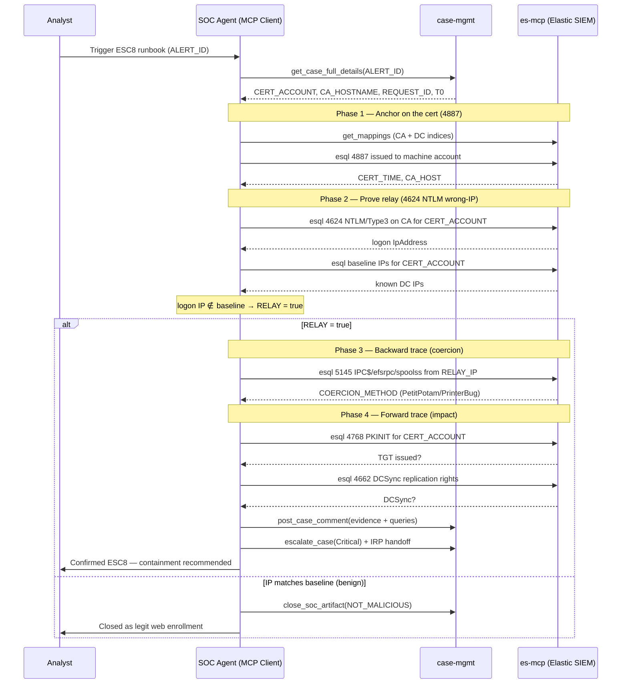

# Runbook: ADCS ESC8 Investigation (NTLM Relay to Web Enrollment)

## Objective

To triage, investigate, and confirm (or refute) a suspected **ADCS ESC8** attack: an adversary **coerces** a high-privilege machine (typically a Domain Controller) into authenticating to an attacker-controlled host (via PetitPotam/PrinterBug-style RPC coercion), **relays** that NTLM authentication to the CA's **HTTP web-enrollment endpoint** (`/certsrv`), and obtains a certificate *as the coerced machine* — yielding DC-level authentication.

Like its ESC1 sibling ([adcs_esc1_certifried_investigation.md](adcs_esc1_certifried_investigation.md)), this runbook uses the **Reverse Trace Strategy**: anchor on the certificate issued to a privileged machine over HTTP, prove the authentication came from the *wrong IP* (relay), walk **backward** to the coercion event (IPC$ access to a coercion RPC interface from an untrusted IP), and **forward** to impact (PKINIT TGT + DCSync).

## Scope

Covers NTLM-relay-to-web-enrollment against ADCS (ESC8) and the coercion primitives that feed it (MS-EFSR/PetitPotam, MS-RPRN/PrinterBug, MS-DFSNM). Uses read-only Elastic queries across the CA server and the coerced DC. Excludes ESC1/Certifried SAN spoofing (see the sibling runbook) and legitimate web-enrollment operations. Hands eradication to the ADCS-abuse IRP.

## Detection Signal / Trigger

*   **Event 4887** — certificate *issued* to a **machine account** (especially a DC) where enrollment was via **HTTP web enrollment** rather than RPC/DCOM.
*   **Event 4624** on the **CA server** — **NTLM** (`AuthenticationPackageName = NTLM`), **Logon Type 3**, from an IP that is **not** the account's known IP.
*   **Event 5145** on a DC — IPC$ access to a coercion interface (`efsrpc`, `lsarpc`, `spoolss`, `netdfs`) from an unverified IP.
*   Analyst-initiated hunt.

## Inputs

*   `${ALERT_ID}` / `${CASE_ID}`: Triggering alert/case.
*   `${CERT_ACCOUNT}`: The machine account the cert was issued to (e.g., `GALACTIC\HOTH$` — a DC).
*   `${CA_HOSTNAME}`: The CA / web-enrollment server (e.g., `pki01.galactic.empire`).
*   *(Optional)* `${REQUEST_ID}`, `${T0}` (alert time), `${TIME_FRAME_HOURS}` (default `6` — relay + coercion happen in a tight window).

## Tools

*   **`es-mcp` (Elasticsearch SIEM — read-only):** `esql` (primary), `search` (Query DSL fallback), `get_mappings` / `list_indices` (confirm the CA-server and DC OCSF indices + attribute paths before querying).
*   **`ti-mcp` (Threat Intel — optional):** enrich the relay/attacker `src_endpoint.ip`.
*   **`case-mgmt` (Elastic Cases / SOAR):** `post_case_comment`, `change_case_priority`, `escalate_case`.
*   **Common Steps:** `common_steps/enrich_ioc.md`, `common_steps/find_relevant_soar_case.md`, `common_steps/document_in_soc.md`, `common_steps/close_soc_artifact.md`.

> **Read-only guarantee:** No containment is executed here. The runbook *recommends* actions (revoke cert, disable EPA/HTTP enrollment, isolate relay host) and routes them to the ADCS IRP / human approval gate.

## Data Model Reference (Windows Event → OCSF, as indexed in Elastic)

SIEM data is normalized to **OCSF** before indexing; queries use OCSF attribute paths. ESC8 evidence spans **two hosts** (CA server + coerced DC) — confirm with `es-mcp.get_mappings` that both are in the OCSF stream. The Windows Event ID is preserved in `metadata.event_code`; source-specific detail (SMB share, RPC interface) with no OCSF class lands under `unmapped.*`.

*   **Relevant OCSF class:** `4624` maps to **Authentication** (`class_uid 3002`) — `auth_protocol_id` and `logon_type_id` are first-class here. `4887` (ADCS issue) and `5145` (share access) have no dedicated class → anchor on `metadata.event_code`, read detail from `unmapped.*`.

| Concept | Windows | OCSF (as indexed in Elastic) |
| --- | --- | --- |
| Event ID (anchor) | 4887/4624/5145/4768 | `metadata.event_code` |
| Auth protocol (NTLM) | AuthenticationPackageName=`NTLM` | `auth_protocol_id == 1` |
| Logon type | LogonType=`3` (network) | `logon_type_id == 3` |
| Source IP of logon | IpAddress | `src_endpoint.ip` |
| Logon target account | TargetUserName | `user.name` |
| Host / CA | Computer | `device.hostname` |
| Share name (5145) | ShareName (`\\*\IPC$`) | `unmapped.ShareName` |
| RPC interface (5145) | RelativeTargetName (`efsrpc`…) | `unmapped.RelativeTargetName` |
| Cert requester (4887) | Requester | `unmapped.Requester` |
| Request ID | RequestId | `unmapped.RequestId` |
| PKINIT (4768) | PreAuthType `16` / CertIssuerName | `auth_protocol_id == 2` **with** `certificate` populated; fallback `unmapped.PreAuthType` |

## Workflow Steps & Diagram

### Phase 0 — Context & Setup

1.  **Receive Alert:** Pull context (`case-mgmt.get_case_full_details`); extract `${CERT_ACCOUNT}`, `${CA_HOSTNAME}`, `${REQUEST_ID}`, alert time `${T0}`.
2.  **Resolve Indices & Fields:** `es-mcp.list_indices` + `get_mappings` for both the **CA-server** and **DC** OCSF data. Confirm the paths for `auth_protocol_id`, `logon_type_id`, `src_endpoint.ip`, and whether `RelativeTargetName`/`ShareName` were promoted or left under `unmapped.*`. **Do not assume.**

### Phase 1 — Anchor: Cert Issued to a Privileged Machine (4887)

3.  **Confirm issuance to a machine account** — ESC8's payoff is a cert for a computer/DC identity.

    ```esql
    FROM ocsf-*
    | WHERE metadata.event_code == "4887" AND metadata.log_name == "Security"
    | WHERE unmapped.RequestId == "${REQUEST_ID}"
       OR unmapped.Requester == "${CERT_ACCOUNT}"
    | KEEP @timestamp, device.hostname, unmapped.Requester,
           unmapped.RequestId, unmapped.Attributes
    | SORT @timestamp ASC
    ```

    A cert issued to a **DC machine account** (`HOTH$`) is the pivot. Store `CERT_TIME`, `CA_HOST`.

### Phase 2 — Prove the Relay: Wrong-IP NTLM Logon on the CA (4624)

4.  **Find the NTLM network logon on the CA server** that authorized enrollment, around `CERT_TIME`.

    ```esql
    FROM ocsf-*
    | WHERE metadata.event_code == "4624" AND metadata.log_name == "Security"
    | WHERE device.hostname == "${CA_HOSTNAME}"
    | WHERE auth_protocol_id == 1        // 1 = NTLM
       AND logon_type_id == 3            // 3 = Network
       AND user.name == "${CERT_ACCOUNT}"
    | KEEP @timestamp, user.name,
           src_endpoint.ip, unmapped.WorkstationName,
           auth_protocol_id
    | SORT @timestamp DESC
    ```

5.  **The relay tell — IP mismatch (Elastic-derived baseline):** Establish `${CERT_ACCOUNT}`'s *legitimate* IP(s) from Elastic and compare to the logon `IpAddress`:
    *   Baseline the DC's real IP from historical events it originated (e.g., 4768/4769 issued by that DC, or its own 4624s), or a `dc-inventory` / asset index.

        ```esql
        FROM ocsf-*
        | WHERE user.name == "${CERT_ACCOUNT}"
        | STATS count = COUNT(*) BY src_endpoint.ip
        | SORT count DESC
        ```

    *   **NTLM logon IP ∉ baseline IPs** → authentication was relayed from the attacker's host, **not** the DC → **strong ESC8 indicator.** Set `RELAY_IP = src_endpoint.ip`, `RELAY = true`.
    *   Also flag: **Kerberos would be normal here**; NTLM enrollment for a machine account against the CA is itself suspicious.

### Phase 3 — Backward Trace: Confirm Coercion (5145 on the DC)

6.  **Hunt the coercion** — IPC$ access to a coercion RPC interface on the victim DC (`${CERT_ACCOUNT}`'s host) from an untrusted IP, just before the relay.

    ```esql
    FROM ocsf-*
    | WHERE metadata.event_code == "5145" AND metadata.log_name == "Security"
    | WHERE unmapped.ShareName LIKE "*IPC$*"
    | WHERE unmapped.RelativeTargetName IN ("efsrpc", "lsarpc", "samr", "netlogon", "lsass", "spoolss", "netdfs")
    | KEEP @timestamp, device.hostname, actor.user.name,
           src_endpoint.ip, unmapped.RelativeTargetName
    | SORT @timestamp DESC
    ```

    *   `efsrpc` → **PetitPotam** (MS-EFSR); `spoolss` → **PrinterBug** (MS-RPRN); `netdfs` → **DFSCoerce**.
    *   IPC$/coercion access from `RELAY_IP` (or another attacker IP) **immediately before** the CA NTLM logon → **coercion→relay chain confirmed.** Set `COERCION = true`, `COERCION_METHOD`.

### Phase 4 — Forward Trace: Measure Impact (4768, 4662)

7.  **Cert used for PKINIT** — TGT obtained as the coerced DC.

    ```esql
    FROM ocsf-*
    | WHERE metadata.event_code == "4768" AND metadata.log_name == "Security"
    | WHERE user.name == "${CERT_ACCOUNT}"
       AND ((auth_protocol_id == 2 AND certificate IS NOT NULL)
            OR unmapped.PreAuthType == "16" OR unmapped.CertIssuerName IS NOT NULL)
    | WHERE @timestamp >= "${CERT_TIME}"
    | KEEP @timestamp, user.name, certificate.issuer, unmapped.CertIssuerName, src_endpoint.ip
    | SORT @timestamp ASC
    ```

8.  **DCSync / replication abuse** — with DC auth, hunt **Event 4662** on the domain object with the replication extended-right GUIDs (`DS-Replication-Get-Changes` `1131f6aa-...`) from a non-DC source. Scope blast radius via downstream 4624/4672.

### Phase 5 — Enrichment, Verdict & Handoff

9.  **Enrich** `RELAY_IP` / attacker host via `common_steps/enrich_ioc.md` (+ `ti-mcp`). Check related cases via `common_steps/find_relevant_soar_case.md`.
10. **Render Verdict** (matrix below); document all queries + **negative results** with `case-mgmt.post_case_comment`.
11. **Containment Recommendation (IRP handoff — human-approved):**
    *   **Revoke** the issued certificate.
    *   **Disable HTTP web enrollment** or **enforce Extended Protection for Authentication (EPA)** + **Require SSL** on `/certsrv`; enforce SMB/RPC signing.
    *   **Isolate** the relay host (`RELAY_IP`); **patch/mitigate** PetitPotam (MS-EFSR) and PrinterBug.
    *   If PKINIT/DCSync confirmed → treat as **domain compromise**: krbtgt double-reset, DC certificate reissuance.
12. **Completion:** Mermaid diagram of actions taken; execution date/time; token/runtime metadata; escalate or close per verdict.

### Decision Matrix (Verdict Logic)

| 4887 to machine acct | 4624 NTLM wrong-IP (relay) | 5145 coercion (backward) | 4768 PKINIT (impact) | **Verdict** | Action |
| --- | --- | --- | --- | --- | --- |
| Yes | No (IP matches) | No | No | **Benign / FP** | Close (legit web enrollment) |
| Yes | Yes | No | No | **Suspicious** | Escalate T2; audit web-enrollment/EPA |
| Yes | Yes | Yes | No | **True Positive — relay confirmed** | Revoke cert; isolate relay host |
| Yes | Yes | Yes | Yes | **Confirmed Critical — DC compromise** | ADCS IRP; domain-compromise IR |



## Completion Criteria

- Certificate issuance to a machine/DC account confirmed (4887).
- NTLM Type-3 logon on the CA located and its IP compared against the account's Elastic-derived baseline (relay proven/disproven).
- Backward trace (5145 coercion) executed; coercion method identified or absence documented.
- Forward trace (4768 PKINIT, 4662 DCSync) executed to measure impact.
- Verdict rendered per matrix; all queries + negatives documented; audit trail complete.
- Containment recommendations handed to the ADCS IRP (not auto-executed) on TP/Confirmed.

## Expected Outputs

- **Verdict:** Benign / Suspicious / True Positive / Confirmed Critical, with evidence.
- **Timeline:** 5145 coercion → 4624 NTLM relay on CA → 4887 cert issued → 4768 PKINIT → 4662 DCSync.
- **Key Entities:** `CERT_ACCOUNT` (coerced DC), `RELAY_IP`/attacker host, `CA_HOSTNAME`, `RequestId`/serial, `COERCION_METHOD`.
- **Containment Recommendation:** cert revocation, EPA/SSL enforcement, disable HTTP enrollment, relay-host isolation, coercion patching.
- **Sequence Diagram**; execution date/time; token/runtime metadata if available.

## Rubric

### 1. Anchor & Field Discovery (15 Points)
*   **Two-Host Index Resolution (7 Points):** Did the agent resolve BOTH the CA-server and DC indices/fields via `get_mappings` before querying?
*   **Certificate Anchor (8 Points):** Did the agent confirm 4887 issuance to a machine/DC account?

### 2. Relay Proof (25 Points)
*   **NTLM Logon Retrieval (12 Points):** Did the agent find the 4624 NTLM/Type-3 logon on the CA for the cert account?
*   **IP Baseline & Mismatch (13 Points):** Did the agent establish the account's baseline IP(s) from Elastic and identify the wrong-IP relay indicator?

### 3. Reverse Trace Execution (30 Points)
*   **Backward Trace / Coercion (15 Points):** Did the agent hunt 5145 IPC$ coercion interfaces and identify the method (PetitPotam/PrinterBug/DFSCoerce)?
*   **Forward Trace / Impact (15 Points):** Did the agent search 4768 PKINIT and 4662 DCSync to measure impact (and note negatives)?

### 4. Verdict & Handoff (15 Points)
*   **Verdict (8 Points):** Consistent with the decision matrix and evidence?
*   **Containment Handoff (7 Points):** Recommendations routed to the IRP without auto-executing destructive actions?

### 5. Visual Summary & Metadata (10 Points)
*   **Sequence Diagram (5 Points):** Valid Mermaid diagram of actions taken.
*   **Date/Time & Cost (5 Points):** Execution timestamp and token/runtime (or noted unavailable).

### 6. Resilience & Quality (10 Points)
*   **Error Handling (5 Points):** Graceful handling of missing fields / single-host visibility gaps without hallucinating.
*   **Output Formatting (5 Points):** Well-structured, no internal monologue.

### Critical Failures (Automatic Failure)
*   Declaring ESC8 confirmed **without** the wrong-IP NTLM relay evidence.
*   Ignoring a certificate issued to a **DC machine account via NTLM** and closing it as benign.
*   Failing to check the DC for the coercion event (5145) when a relay is indicated.
*   Executing destructive containment directly from this read-only runbook, or hallucinating a coercion/PKINIT event not in the logs.
