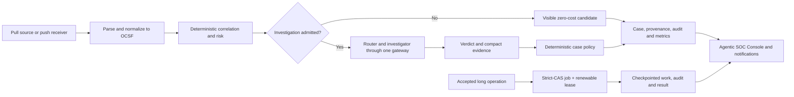

# Architecture

This page applies to **Agentic SOC 0.1**. It is for evaluators, operators, and integrators
who need the shipped system boundary before configuring data or automation.

Agentic SOC is a read-only security-triage layer. It receives or reads security events,
normalizes them to OCSF, performs deterministic reduction and risk work, admits a
bounded subset to model-backed investigation, and stores an auditable case. It does
not replace or modify the upstream SIEM, EDR, queue, or event pipeline.

## Components

| Component | Responsibility |
| --- | --- |
| Agentic SOC Console | Standalone React interface for setup, sources, cases, analytics, administration, and audit |
| Agentic SOC API | FastAPI application containing connectors, normalization, engines, agents, policy, auth, and API routes |
| Connector registry | Pull connectors and push receivers that expose one manifest and normalization contract |
| OCSF boundary | Canonical event subset plus lossless source provenance and unmapped fields |
| Deterministic engines | Correlation, risk, budget admission, baselines, tuning, campaigns, and case policy |
| LLM gateway | The only path to a model provider and the usage/cost ledger |
| StateStore | Agentic SOC-owned cases, configuration, cursor, usage, audit, users, and knowledge in PostgreSQL, SQLite, or Elasticsearch |
| Background-job runner | In-process executor over a strict-CAS StateStore registry, with leases, Inbox/SSE progress, cooperative cancellation, and verified artifacts |

## Shipped signal flow

Pull connectors are polled per enabled source and feed. Push receivers deliver
normalized batches into the same correlation and case pipeline. Source identity is
retained throughout, so the console can distinguish what the source reported, what
the model assessed, and what code decided.

## Two data planes

The economical design separates two kinds of work:

1. The **deterministic data plane** parses, maps, deduplicates, correlates, scores,
   counts, and learns bounded aggregate baselines without a model call.
2. The **bounded reasoning plane** enriches and investigates candidates admitted by
   source role, deterministic risk, operator policy, caps, and budget.

This means “Agentic SOC reads every enabled event” does not mean “every event is sent to a
model.” Below-threshold event candidates remain visible and cost nothing.

## Trust boundaries

- Pull connectors use read-only, pattern-scoped source credentials.
- Push receivers authenticate the sender at their transport boundary.
- Event-derived text remains untrusted, including raw and unmapped OCSF fields.
- Model output is advisory; deterministic policy owns close or escalation.
- Agentic SOC application state is separate from the source log store.
- Every model call and state-changing action has a ledger or audit record.

## Agentic SOC 0.1 boundaries

The API, receivers, polling, schedules, correlation, and investigation run in one
backend process. Operate one backend replica. HTTP push processing has no durable
receipt inbox before correlation, and the push live-tail and realtime replay buffers
are process-local. Several connectors require transport-specific durability testing.

These are explicit evaluation constraints, not properties of the target scale-out
design. See [Known limitations](../releases/known-limitations.md).

Application background jobs make accepted long work durable across Console navigation,
reload, and ordinary backend restart recovery. They do not create a distributed worker
plane: job execution, investigation priority, export assembly, and realtime publication
are process-local, and the wider application still has single-replica authorities. The
separate supervised-updater job protocol is unchanged. See
[Background jobs](../operations/background-jobs.md).

## Related pages

- [Ingestion and investigation](../architecture/ingestion.md)
- [OCSF normalization](ocsf.md)
- [Deterministic decisions](deterministic-decisions.md)
- [State, audit, and cost](state-audit-cost.md)
- [Background jobs](../operations/background-jobs.md)
