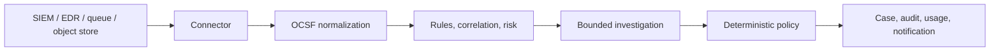

# Agentic SOC Help Center

Use the product, administer the platform, and operate the release that is actually installed.

This is the **product documentation**—also called the **Help Center**—for Agentic SOC.
The first section is the user and analyst guide; administration, deployment,
reference, and release material live in the same searchable portal.

!!! info "Matched to this app"

    **Documentation 0.1** describes **Agentic SOC 0.1.13**. The application bundles this
    Help Center from the same accepted source and serves it on the application
    origin under `/docs/0.1/`. Use it as the authority for the behavior and controls
    available in the running build. The channel badge identifies whether that build
    is a Testing candidate or a supported Stable release.

## Use the product

Most readers should begin here.

| Goal | Read this |
| --- | --- |
| Understand the console and start a shift | [User and analyst overview](analyst/overview.md) |
| Trace one alert through triage | [Work your first case](getting-started/first-case.md) |
| Work the split-pane queue or select cases in bulk | [Case Manager](analyst/case-manager.md) |
| Understand a case assessment and decision | [Investigation](analyst/investigation.md) |
| Ask a read-only question or resume a saved analyst conversation | [Workspace Chat](analyst/chat.md) |
| Find source evidence | [Logs and search](analyst/logs-search.md) |
| Coordinate analyst work | [Collaboration](analyst/collaboration.md) |
| Build or update a response procedure | [Playbooks and approvals](automation/playbooks-approvals.md) |
| Add reusable investigation guidance | [Runbooks](intelligence/runbooks.md) |
| Read posture and performance | [Analytics](analyst/analytics.md) |
| Monitor long-running work, cancellation, and downloads | [Background jobs](operations/background-jobs.md) |

If this is your first session, [choose a getting-started path](getting-started/index.md).
The deterministic Demo Mode is the shortest way to explore the workflow without
external infrastructure or model cost.

## Find the right guide

The Help Center is one portal with five stable entry points:

| Section | Use it for |
| --- | --- |
| **Use the product** | Daily analyst work, cases, investigations, collaboration, automation, and intelligence |
| **Administer** | Sources, settings, identities, permissions, models, notifications, and organization policy |
| **Deploy and operate** | Installation, runtime configuration, hardening, health, backup, upgrades, and troubleshooting |
| **Reference** | Architecture, terminology, API and configuration contracts, permissions, compatibility, and extension development |
| **Releases and versions** | Installed-versus-Stable guidance, release notes, channel rules, limitations, and upgrade planning |

## What Agentic SOC does

Agentic SOC is a vendor-neutral, self-hosted security operations console. It pulls or
receives security records from supported sources, normalizes each record to
**OCSF 1.4.0**, correlates related activity, computes deterministic risk, and
creates human-reviewable cases.

When a case merits model investigation, Agentic SOC sends compact, explicitly fenced
evidence through a single model gateway. The model supplies a verdict and
confidence; deterministic operator policy alone decides whether the case closes,
escalates, or requires a human.

## Product guarantees

- **Source systems stay read-only.** Pull credentials are scoped to the selected
  data and Agentic SOC never writes back to an upstream SIEM.
- **Models do not own the final action.** The close/escalate function is pure code
  over verdict, confidence, risk, and operator policy. `NEEDS_HUMAN` can never
  auto-close.
- **Every model call is accounted for.** One gateway records usage and cost and
  enforces the configured daily budget before work begins.
- **Untrusted telemetry is fenced.** Source-controlled values remain labelled as
  untrusted in chat, investigation, retrieval, and tool results.
- **Actions are reviewable.** Cases retain evidence provenance, investigation
  traces, status history, collaboration, and append-only audit records.
- **Storage is selectable.** Agentic SOC bookkeeping can use PostgreSQL, SQLite, or
  Elasticsearch independently of the upstream log source.

## Documentation by role

### Users and analysts

Start with the [analyst workflow](analyst/overview.md), then continue to
[cases](analyst/cases.md), [Case Manager](analyst/case-manager.md),
[investigation](analyst/investigation.md), [Workspace Chat](analyst/chat.md),
[logs and search](analyst/logs-search.md),
[campaigns](analyst/campaigns.md), and [analytics](analyst/analytics.md).

### Detection engineers

Read [automation](automation/index.md), [rules](automation/rules.md),
[tuning and baselines](automation/tuning-baselines.md), and
[playbooks and approvals](automation/playbooks-approvals.md). Maintain retrievable
investigation guidance under [Runbooks](intelligence/runbooks.md). Source mapping and
custom connector guidance is grouped under [data sources](sources/index.md).

### Administrators

Use the [settings map](administration/settings.md),
[users and RBAC](administration/users-rbac.md),
[authentication](administration/authentication.md), and
[source administration](sources/index.md). Administrators who also own the runtime
should review [background jobs](operations/background-jobs.md),
[security hardening](operations/security.md), and
[health and backup](operations/health-backup.md).

### Deployment operators, developers, and integrators

Use [deployment](operations/deployment.md), [upgrades](operations/upgrades.md), and
[troubleshooting](operations/troubleshooting.md) for the runtime. The
[architecture](concepts/architecture.md), [API](reference/api.md),
[configuration](reference/configuration.md), [permissions](reference/permissions.md),
and [development guide](development/index.md) cover technical contracts.

## Choose the correct documentation version

- **Installed version** is the default and the authority for operating this app.
- **Latest Stable** is useful when evaluating an upgrade or checking whether a
  supported release contains newer guidance.
- **Development** describes integrated work that has not completed Stable
  acceptance; treat it as a preview, not as instructions for the installed app.

Confirm the application identity in the top-right release badge or at
`/api/health/build-info`, then read [Documentation versions](releases/documentation-versions.md).
The GitHub repository is available as a secondary source and edit destination; it
does not replace the version-matched Help Center bundled with the application.

## Release status

Agentic SOC uses one promotion path: feature branches merge into **Testing**, and the
accepted source tree promotes through a protected pull request to **`main` /
Stable**. The current source version uses SemVer `0.1.13`; compatible documentation
uses the major.minor line `0.1`.

The repository uses default `main` for accepted source and retains `Testing` for
integration. Version 0.1.13 is Stable only when the exact accepted `main` commit has
the immutable `v0.1.13` tag and matching signed/public artifacts and every canonical
runtime acceptance gate passes. Repository
protections and the native Pages deployment remain
administrator-controlled and must be verified independently before treating a
branch, workflow run, or public URL as accepted. The immutable `v0.1.4` and
`v0.1.5` tags are failed, non-installable publication records. Version `v0.1.9`
is also non-installable: its constrained signed-plan check failed before Release
publication. Version `v0.1.10` is immutable and non-installable: its signed-release
workflow timed out during the emulated Web Console builder before the complete
artifact set or GitHub Release existed. Version 0.1.11 completed image and plan
verification but failed during post-verification cleanup before its GitHub Release
or canonical assets were published. Version 0.1.12 completed the entire public,
signed publication, but canonical v0.1.1 bootstrap failed closed before application
mutation because matching absent legacy state-schema labels were normalized
asymmetrically. It is bootstrap-blocked and not an installation source. Version
0.1.13 remains a candidate until its
full signed-publication and canonical acceptance evidence exists. Read
[Agentic SOC 0.1.13](releases/0.1.13.md),
[the 0.1.12 bootstrap-blocked publication record](releases/0.1.12.md),
[the 0.1.11 failed-publication record](releases/0.1.11.md),
[the 0.1.10 failed-publication record](releases/0.1.10.md),
[the 0.1.9 failed-publication record](releases/0.1.9.md),
[the 0.1.8 bootstrap-blocked publication record](releases/0.1.8.md),
[the 0.1.7 bootstrap-blocked publication record](releases/0.1.7.md),
[the 0.1.6 bootstrap-blocked publication record](releases/0.1.6.md),
[the 0.1.5 failed-publication record](releases/0.1.5.md),
[the 0.1.4 failed-publication record](releases/0.1.4.md),
[release channels and versioning](releases/channels.md), and
[known limitations](releases/known-limitations.md) before deployment.
