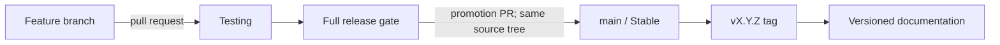

# Release channels and versioning

Agentic SOC's release contract has two channels and two long-lived branches. Work
integrates on **Testing**. The accepted source tree is then promoted through a
protected pull request to **Stable** on `main`, and the resulting `main` commit is
verified. There is no third prerelease branch and no separate release-branch
vocabulary.

!!! note "Current repository topology"

    The remote now exposes both canonical branches and uses `main` as the default.
    Repository administrators must still keep the required pull-request gates and
    the `CI passed` aggregate enforced; a branch name alone never proves that a
    particular build passed acceptance.

## Channel contract

| Channel | Branch | Intended use | Publication |
| --- | --- | --- | --- |
| **Testing** | `Testing` | Integrated changes, acceptance testing, upgrade rehearsal, and documentation review | CI artifacts and documentation preview only |
| **Stable** | `main` | Supported releases and deployment artifacts | Immutable `vX.Y.Z` tag, versioned docs, and Stable image/package metadata |



The branch names and channel names are deliberately different kinds of label:

- write **`Testing`** when referring to the integration branch or channel;
- write **`main`** when referring to the Git branch;
- write **Stable** when referring to the release channel represented by `main`.

Do not use “alpha”, “Bleeding Edge”, “next”, or a generic “production branch” as
synonyms for these channels.

For operators, this distinction is concrete: after `main` is provisioned, an
ordinary clone or pull of `main` receives the last accepted Stable source tree,
never in-progress work from `Testing`. Pulling `Testing` receives the current
integration candidate and may include changes that have not passed release
acceptance.

The Console's **Settings → Organization → Updates & releases** section observes these
two source refs by default. A fork or renamed repository can replace the public GitHub
URL and either branch name without changing the application wire namespace. This is
metadata discovery only: an observed branch-head commit is linked for review and
cannot deploy or activate itself. Stable discovery separately dereferences the exact
annotated `vVERSION` tag; only that immutable tag commit can become an update
candidate. For a bootstrapped supported deployment, the actual top-bar action
additionally requires a newer Stable version, a compatible signed release plan,
the private updater's preflight, durable secrets and PostgreSQL state, exact image
digests, a verified backup, and recent built-in-super-admin reauthentication. After a
successful installation, the same-origin Console manifest must still exactly match a
healthy backend build before the new document activates.

## Version 0.1 nomenclature

The first standardized release line is documentation version **0.1**. The current
source version is product version **0.1.13**. It carries the accepted application
scope through 0.1.12 and corrects the legacy identity comparison that blocked the
published v0.1.12 release during canonical v0.1.1 preflight. The immutable
`v0.1.4` publication attempt produced documentation but no application artifacts.
The immutable `v0.1.5` workflow built and signed candidate image digests but stopped
before publishing the canonical signed plan, GitHub Release, or Stable tags. Both are
historical and non-installable. The immutable `v0.1.6` images, signed plan, bundle,
and GitHub Release published successfully, but canonical macOS Bash 3.2 bootstrap
acceptance failed before supervisor installation; it is superseded and not a
supported installation source. Version 0.1.7 met its exact-tag artifact-publication
contract: the signed plan, public GitHub Release, and public digest-pinned images all
verify. Canonical acceptance then found that the shipped updater failed control-socket
startup under the capability boundary. Version 0.1.7 is therefore historical,
bootstrap-blocked, and superseded. Version 0.1.8 completed its exact-tag signed/public
artifact publication, then canonical bootstrap failed when cosign 3 tried to write
its default TUF cache beneath the read-only `/root` filesystem. It is immutable,
bootstrap-blocked, and superseded. Version 0.1.9 corrected that trust-root path and
passed exact-tag CI, signed/public digest and anonymous-registry checks, and host-side
plan verification. Its constrained updater could not traverse the runner-owned
verification bind source, so attestations, GitHub Release publication, canonical
plan assets, Stable convenience tags, and Stable documentation were skipped. It is
immutable partial evidence and non-installable. Version 0.1.10 then passed protected
source and exact-tag CI, but the signed-release workflow timed out while the
architecture-neutral Web Console builder ran under target emulation. It published
no complete three-image set, canonical signed plan, GitHub Release, Stable tags, or
Stable documentation and is immutable, superseded, and non-installable. Version
0.1.11 workflow built, signed, anonymously proved, and verified all three images and
the canonical plan on the host and inside the constrained updater. Its cleanup trap
then failed to unlink read-only verification files while their runner-owned parent
directory remained mode `0555`, so attestations, GitHub Release publication,
canonical asset publication, Stable tags, and Stable documentation were skipped. It
is immutable partial evidence and non-installable. Version 0.1.12 corrected that
cleanup and published the complete signed/public release, but canonical v0.1.1
bootstrap stopped before application mutation because both legacy application
images omit the state-schema label and the supervisor compared one normalized
absence with one raw absence. It is immutable, bootstrap-blocked, and superseded.
Version 0.1.13 normalizes matching absent legacy labels symmetrically while mixed
labels and every unmanaged later identity remain blocked. It is Stable only when its
exact accepted `main` commit is immutably
tagged `v0.1.13` and its complete signed/public artifact set plus updater runtime and
canonical deployment acceptance verify. If that evidence is incomplete, use a
previously verified supported Stable release.

| Surface | Canonical value |
| --- | --- |
| Product | Agentic SOC |
| Operator interface | Agentic SOC Console |
| Backend service/API | Agentic SOC API |
| SemVer package and image version | `0.1.13` |
| Git release tag | `v0.1.13` only from the exact verified `main` commit; absent before publication and immutable afterward |
| Documentation selector and URL line | `0.1` and `/0.1/` |
| Integration branch/channel | `Testing` |
| Stable branch/channel | `main` / Stable |

Patch releases remain within the same documentation line. For example, app
versions `0.1.1`, `0.1.2`, `0.1.3`, `0.1.4`, `0.1.5`, `0.1.6`, `0.1.7`, `0.1.8`, `0.1.9`, `0.1.10`, `0.1.11`, `0.1.12`, and `0.1.13` use the `0.1` documentation rather than
creating new selector entries. A new minor release creates a new documentation
line such as `0.2`.

## Promotion procedure

Every release starts with a candidate commit on `Testing`:

1. Merge focused feature branches into `Testing` through reviewed pull requests.
2. Run the backend, web console, documentation, generated-contract, security, and
   deployment-configuration gates on that commit.
3. Freeze the candidate while acceptance and upgrade checks run. Fix failures on
   a feature branch and merge them back into `Testing`; do not patch `main` first.
4. Promote the accepted `Testing` source tree to `main` through a protected pull
   request. The merge commit may have a different SHA, but the promotion must not
   introduce content changes; re-run the complete gate on that resulting `main` SHA.
5. Create the immutable `vX.Y.Z` tag from the verified `main` commit and publish
   artifacts from that SHA using the same `X.Y.Z` value from the root `VERSION` file.
6. Let the documentation workflow publish the matching major.minor line and move
   the `stable` and `latest` aliases to it.

The Documentation workflow validates `Testing` and `main`, but publication is gated
on the exact annotated `vX.Y.Z` tag. Its tag must match `VERSION` and resolve to the
current `origin/main` commit. Configure the `github-pages` environment to admit the
`v*` release-tag pattern, and keep **Settings → Pages → Source** set to **GitHub
Actions**. A `main` push alone must never move the public Stable aliases.

Use an annotated tag and verify it before pushing:

```bash
git switch main
git pull --ff-only origin main
test "$(cat VERSION)" = "X.Y.Z"
test -z "$(git status --porcelain)"
git tag -a "vX.Y.Z" \
  -m "Agentic SOC X.Y.Z" \
  -m "<operator-relevant release summary>. Detailed notes: docs/releases/X.Y.Z.md; CHANGELOG.md."
test "$(git cat-file -t 'vX.Y.Z')" = "tag"
test "$(git rev-parse 'vX.Y.Z^{commit}')" = "$(git rev-parse HEAD)"
git show --no-patch "vX.Y.Z"
git push origin "vX.Y.Z"
```

Replace `X.Y.Z` with the real `VERSION` value and replace the summary placeholder
with the release's concrete operator-visible scope. Publish the GitHub Release from
that existing tag with the versioned release page and changelog as canonical notes.
`.github/release.yml` defines repository PR-note categories but does not replace the
canonical versioned release body. Published tags are
immutable; never force-update one. The workflow first creates a non-public draft bound
to the exact tag and commit SHA, uploads both canonical upgrade-plan assets, downloads
and byte-compares them, verifies the Sigstore bundle, and only then changes the draft to
published in one API transition. An interrupted retry may resume only that exact draft:
an authenticated plan is reused, incomplete `starter` uploads are removed, and a
missing signature bundle is recreated and verified before publication. A published
release is never repaired or overwritten; a missing, duplicate, unexpected, or partial
asset inventory fails closed and requires a new patch release. A later workflow retry
may reuse the latest completed, successful `ci.yml` push run only when its tag ref and
commit SHA exactly match that immutable release; it is deliberately not coupled to the
retry's wall-clock time.

### Changelog discipline

`CHANGELOG.md` has exactly one active top-level **`[Unreleased]`** section during
normal development. Dated work that is not a published release is a **Development
snapshot**, not another `[Unreleased]` section and not a bracketed SemVer release.

As part of the final frozen release-preparation change:

1. move the accepted entries out of `[Unreleased]` under `[X.Y.Z]` with the release
   date;
2. open a new, empty `[Unreleased]` section above it;
3. promote and verify that exact prepared tree on `main`; and
4. tag that exact verified commit immediately.

If promotion is abandoned, revert the prepared release heading rather than leaving
a Testing snapshot that reads as though it were published. Never keep multiple
top-level `[Unreleased]` sections as a dated work log; the development journal and
Development snapshot headings hold that history.

If a Stable defect is found, fix it through `Testing`, exercise the same gate, and
promote a patch release. Emergency timing may shorten review windows, but it does
not reverse the direction of promotion.

## Release gate

A candidate is promotable only when all required checks pass and the release notes
describe its real operating boundary. At minimum:

- canonical version metadata, OpenAPI, TypeScript contracts, image defaults, and
  release notes agree;
- the Workspace Chat Help Center corpus is regenerated for the candidate: after any
  `VERSION`, documentation, or Console navigation change, run `npm run gen:console-map`
  in `webui/` and then `python scripts/build_app_knowledge.py`. The corpus records the
  product version, so the documentation lane's `--check` fails until it is rebuilt;
- backend tests, web console lint/tests/build, and strict documentation build pass;
- the supported PostgreSQL+pgvector/Redis state lane performs a real readiness
  write/read, and every shipping backend, Console, and updater image builds with the
  exact candidate identity before any tag can publish it;
- the exact digest-pinned updater verifies the signed canonical plan inside the
  constrained read-only runtime, with its baked cosign TUF root writable on the
  updater-state volume and both immutable `/verification` inputs readable beneath
  the dropped-capability runtime, before the GitHub Release becomes public;
- workflow/ShellCheck and deploy/updater contracts run as separate required lanes so
  one early failure cannot hide another; the fail-closed `CI passed` aggregate must
  succeed on `Testing`, the resulting `main` commit, and the immutable tag;
- the documented Console release-candidate browser matrix passes on the exact built
  candidate in Light, Dark, and System at desktop and narrow widths, with build SHA,
  release badge, keyboard/focus, loading/error/empty behavior, same-origin Help Center,
  and unexplained console/network errors recorded in a dated receipt;
- deployment configuration validates and upgrade/restore steps are rehearsed for
  the affected state backend;
- source credentials remain least-privilege and upstream systems remain read-only;
- model errors fail safe to `NEEDS_HUMAN`, every model call remains cost-ledgered,
  and deterministic policy remains the sole close/escalate authority;
- known limitations and migration steps are updated before promotion.

Passing unit tests does not by itself make a commit Stable. The accepted source,
release metadata, documentation, and published artifacts must describe the same
thing.

Never remove, soften, skip, or mark a required lane `continue-on-error` merely to
make a release green. Repair the underlying contract and re-run the exact candidate.
The application release and Stable Help Center publication both verify the exact
tag CI run and its successful **CI passed** aggregate before publishing anything.

Use the [release-candidate browser acceptance matrix](../development/testing.md#release-candidate-browser-acceptance)
for the required route and interaction coverage. A screenshot of one successful page
is not a Console acceptance receipt.

## Build and badge provenance

SemVer and channel are independent. The 0.1.13 Testing candidate and its accepted
Stable build can both report version `0.1.13`; the channel says where that build sits in
the acceptance lifecycle. Stamp the mutable provenance fields explicitly; keep or
override the Dockerfile's canonical source URL as appropriate:

| Variable | Purpose |
| --- | --- |
| `TLSOC_VERSION` | Product/image SemVer; must match the root `VERSION` file |
| `TLSOC_RELEASE_CHANNEL` | `testing` for candidates; `stable` only for the verified `main`/tag build |
| `TLSOC_BUILD_SHA` | Exact source commit |
| `TLSOC_BUILD_DATE` | Reproducible build timestamp |
| `TLSOC_SOURCE_URL` | Dockerfile build argument for the canonical source repository URL stored in OCI metadata; the reference Compose files use its repository default |

The authoritative backend value is
`/api/health/build-info.release_channel`; images also carry
`dev.tlsoc.release.channel`. The Console always shows a top-right
`vX.Y.Z · Testing|Stable` badge. Opening it displays the Console and backend
version, channel, commit, and build time separately. When both identities are
available, only explicit matching Stable stamps render Stable; a version, channel,
or known-SHA mismatch immediately downgrades the session badge to Testing. When
backend build-info is unavailable, the immutable Console build stamp determines the
visible channel and remains inspectable.

The web artifact also publishes a same-origin `/release.json` with its immutable
version, channel, commit, and build time. Serve that file with `no-store` semantics.
For a bootstrapped supported Compose/PostgreSQL deployment, the top bar may show
**Update vX.Y.Z** when the backend observes a newer Stable release and the isolated
updater reports a compatible protocol. Branch HEAD remains observation-only; the
release candidate is bound to the dereferenced annotated tag commit. A freshly
authenticated built-in super
administrator must confirm a server-bound preflight. The updater then verifies the
signed plan and digest-pinned artifacts, backs up owned state, performs the rollout,
observes health, and automatically rolls back on failure. A completed rollout uses
the existing no-store manifest, backend identity/readiness, and `/index.html` checks
to reload the open tab; known unsaved drafts block that reload.

Separately, authenticated `settings:read` users may receive a read-only upstream
observation from `GET /api/releases/upstream`. The backend checks only the saved public
GitHub repository and Stable/Testing refs, caches successful metadata, and preserves a
clearly marked last-known-good result when a later check fails. A higher SemVer or a
same-version different SHA may be announced as source for review; an older SemVer is
never called an update. `POST /api/releases/upstream/check` refreshes that metadata
subject to a cooldown. Neither endpoint has Git, deployment, process, migration, or
activation authority.

Neither source-observation endpoint is a release-promotion signal or deployment
authority. Only the private updater socket can reach the host runtime, and its fixed
v1 contract rejects browser-supplied URLs, commands, paths, Compose fragments,
untrusted registries, infrastructure upgrades, and migrations. Deployments without
that supervisor—or outside its exact reference profile—continue to use the manual
upgrade path and receive a precise blocker instead of a misleading install button.

Local `run-demo.sh` derives Stable only from a literal `main` checkout; every
other branch, detached checkout, or unknown channel fails safe to Testing unless
an explicit release-build override is supplied. The documentation marquee is a
separate publication badge controlled by `TLSOC_DOCS_CHANNEL`: the Testing docs
job leaves it as Testing, while the `main` publication job explicitly sets Stable.
No badge becomes Stable from SemVer or a similar-looking branch name alone.

CI follows the same rule: `Testing` pushes and pull requests are stamped Testing;
the protected `main` build and canonical `vX.Y.Z` tag build are stamped Stable.
Dockerfiles default to Testing, so an operator-built Stable image must supply the
explicit channel, SHA, and build date rather than relying on a default.

## Semantic versioning before 1.0

Agentic SOC uses `MAJOR.MINOR.PATCH` SemVer for code, packages, and images:

- increment **PATCH** for backward-compatible fixes within a documentation line;
- increment **MINOR** for a new pre-1.0 capability set or a compatibility change
  that needs its own documentation line;
- reserve **MAJOR** for the post-1.0 compatibility contract.

Before `1.0.0`, a minor increment can contain breaking changes. Those changes must
still have explicit migration notes and cannot be hidden behind the Testing/Stable
channel labels.

### Version every published change, not every internal commit

Every published change to user-visible behavior, dependencies, configuration,
public API contracts, documentation, packaging, or operational procedure receives a
new SemVer and patch notes. Backward-compatible corrections in the existing 0.1
documentation line advance PATCH by one. The patch component is an integer, so
`0.1.21` means patch 21; it is not a fourth-level version for a very small change.

A candidate may bundle several related commits and changes under one version.
Internal refactors, test additions, review fixes, and intermediate commits do not each
need their own version while they remain unpublished inside the same candidate. If
the candidate has already been published and any release content changes—even only
Stable documentation or an operational instruction—prepare the next patch instead of
moving the existing tag or silently republishing its artifacts.

Each release record must cover the operator-visible change, compatibility and
migration impact, rollback considerations, verification evidence, and known
limitations. Choose the candidate version before final acceptance, align every
artifact to it, promote the accepted tree to `main`, verify that exact `main` commit,
and only then create its immutable Stable tag.

## Documentation publication

Every Console build first generates its own version-matched Help Center under
`/docs/<major.minor>/`. That installed copy is part of the application artifact and
is authoritative for operating that exact build. Public publication follows the same
promotion direction as the source:

- a pull request or push to `Testing` runs a strict docs-plus-app build and can
  publish a Development review artifact, but does not move the public Stable site;
- the promoted `main` commit is a final verification input, not publication authority;
  only its matching immutable annotated release tag updates the current major.minor
  history with Mike, assigns the `stable` and `latest` aliases, and keeps older
  documentation directories;
- the generated `gh-pages` branch is the version-history backing store; GitHub Pages
  itself must use **GitHub Actions** as its source, and the workflow deploys a
  validated link-free artifact with the native Pages actions;
- the site version selector prefers the equivalent page in the selected version
  and falls back to that version's home page when the page did not yet exist.

The application rail opens the installed same-origin guide by default. GitHub and the
public Stable/Development sites remain explicit secondary links for source editing,
upgrade comparison, or future-work preview; they never replace installed help
silently.

See [Documentation versions](documentation-versions.md) for URL, alias, and
maintenance rules, and [Agentic SOC 0.1](0.1.md) for this release line.
